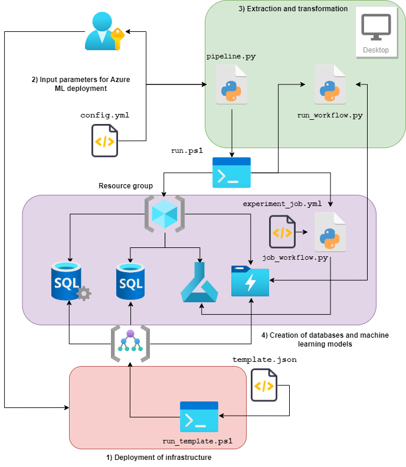

# orchestration-database [](https://github.com/hubpeopleopti/orchestration-database/actions/workflows/code-quality.yml)
A package for designing and implementing ETL. This repository intends to use the following infrastructure in [`Azure`](https://azure.microsoft.com/en-us), which has a _landing zone_ represented by a [`Storage account`](https://learn.microsoft.com/en-us/azure/storage/common/storage-account-overview) where the data is located. This storage has 2 stages, the first one containing the _rawdata_ and the second one containing the _processed_ data in `.parquet` format to be uploaded to the [`SQL server database`](https://azure.microsoft.com/en-us/products/azure-sql/database/). The scheme of this solution is hybrid, having processes that run locally and processes that are managed to run using [`Azure ML`](https://azure.microsoft.com/en-us/products/machine-learning/). For a more detailed description, see below.   

<p align="center">

</p>

## Prerequisites

* To execute the commands shown below, an _Azure Subscription_ is required.
* To run the commands from your _local environment_, you need to install [`Azure CLI`](https://learn.microsoft.com/en-us/cli/azure/).

## Install and run Azure CLI

### Docker container

You can use [`Docker`](https://www.docker.com/) to run a stand-alone Linux container with [`Azure CLI`](https://learn.microsoft.com/en-us/cli/azure/) pre-installed.

```bash
docker pull mcr.microsoft.com/azure-cli
```

The [`Docker image`](https://hub.docker.com/_/microsoft-azure-cli) can be run using the following command:

```bash
docker run -it mcr.microsoft.com/azure-cli
```

### Windows

Here are the instructions to install [`Azure CLI`](https://learn.microsoft.com/en-us/cli/azure/) on Windows using the MSI installer.
1. Download [Azure CLI](https://learn.microsoft.com/en-us/cli/azure/install-azure-cli-windows?tabs=azure-cli)
2. In the installer, accept the terms and select install.

3. Check the installation:

    To run Azure CLI open bash or from the command prompt or from the PowerShell. To verify, execute the following command:

    ```powershell
    az --version
    ```

    Additionally it is necessary to install the Azure Machine Learning extension. To do so, execute the following commands:

    ```powershell
    az upgrade
    az extension add -n ml
    ```

    If you already have the extension, it will be necessary to first run the following command:

    ```powershell
    az extension remove -n azure-cli-ml
    az extension remove -n ml
    ```

    If you want to update the extension, execute the following:

    ```powershell
    az extension update -n ml
    ```

## ETL creation and execution

* ### Scenario 1

    This considers that the infrastructure is not deployed, so the following command lines will be executed:

    ```powershell
    .\templates\run_template.ps1
    Start-Process python pipeline.py -NoNewWindow -Wait
    ```

    Before executing the last command, it is necessary to verify that the `$location_name` variable in the `run_template.ps1` file matches the `location` variable in the `config.yml` file. The same applies to `$resource_group_name` and the variable `resource_group_name`. The only variables that are modified by the user in the `run_template.ps1` file are those that begin with the symbol `$`. However, it is not necessary to modify them directly in the script, if you select `n` to the _use the default values_ option that will appear in the console, the console will give you the option to enter the values as input.
    
    By executing the following command line we will be reproducing the architecture shown above, however, it is possible that the user has the data in another [`Storage account`](https://learn.microsoft.com/en-us/azure/storage/common/storage-account-overview) that is in another resource group. It is also possible that the user wants to execute steps `3)` and `4)` on an already deployed architecture, both cases will be explored in the following scenario.

    ```powershell
    .\run.ps1
    ```

* ### Scenario 2

    Suppose you already have the infrastructure in place and all you want to do is to run an extraction, transformation and loading job on a [`Storage account`](https://learn.microsoft.com/en-us/azure/storage/common/storage-account-overview) in a resource group. In this case, the following command lines must be executed:

    ```powershell
    az login
    $resource_group_name = '<resource_group_name>'
    $storage_account_name = '<storage_account_name>'
    $container_name = '<container_name>'
    $sql_server_name = '<sql_server_name>'
    $database_name = '<database_name>'
    $storageBlob_conn = (az storage account show-connection-string --name $storage_account_name --resource-group $resource_group_name --query 'connectionString' --output tsv)
    $db_conn_string = (az sql db show-connection-string -c odbc -n $database_name -s $sql_server_name -a Sqlpassword --output tsv)
    ```

    The user must replace fields such as `<resource_group_name>`, `<storage_account_name>` and `<container_name>` with the corresponding values. The execution of `run_workflow.py` requires a specialized environment, so as intermediate steps it will be necessary to create and activate such an environment with the necessary requirements before executing the last command line.

    ```powershell
    Start-Process python -ArgumentList './run_workflow.py', $storage_account_name, $storageBlob_conn, $container_name, $resource_group_name, '<exclude_files>', '<sa_container_directory>', $db_conn_string -NoNewWindow -Wait
    ```

* ### Scenario 3

    In this scenario, you have the resource group created and within it is the [`Storage account`](https://learn.microsoft.com/en-us/azure/storage/common/storage-account-overview) that contains the data. In this case you will have to check the `config.yml` file and verify that everything is correct. Subsequently the following lines of code will be executed:

    ```powershell
    Start-Process python pipeline.py -NoNewWindow -Wait
    .\run.ps1
    ```


